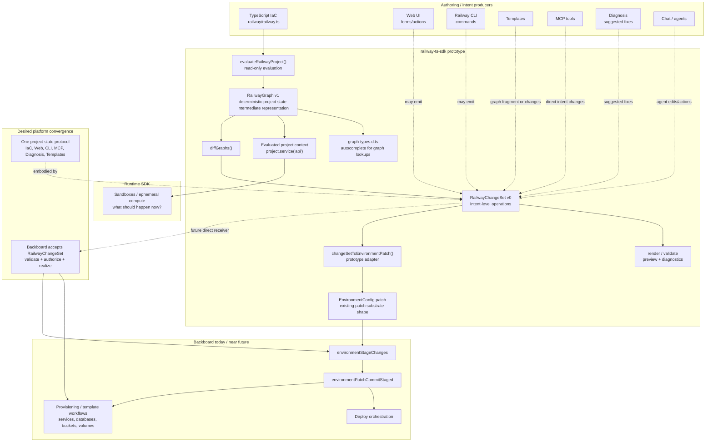

# Railway Project State architecture



## Reading the graph

Today, the SDK proves this path:

```txt
.railway/railway.ts → RailwayGraph → RailwayChangeSet → EnvironmentConfig patch
```

Backboard does **not** receive `RailwayChangeSet` yet. The current bridge compiles changesets back into the existing environment patch shape.

The intended platform direction is:

```txt
all project-state producers → RailwayChangeSet → Backboard validation/provisioning/stage/apply
```
